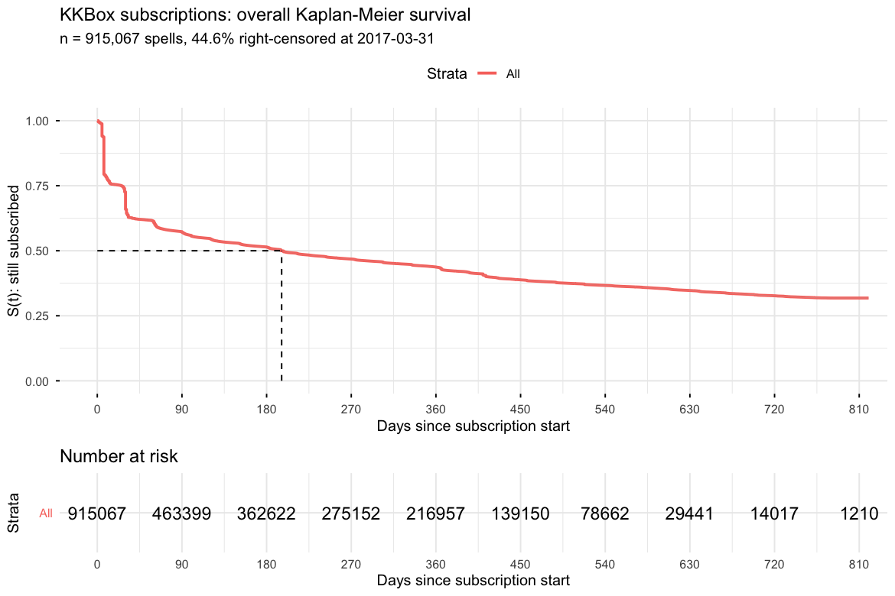
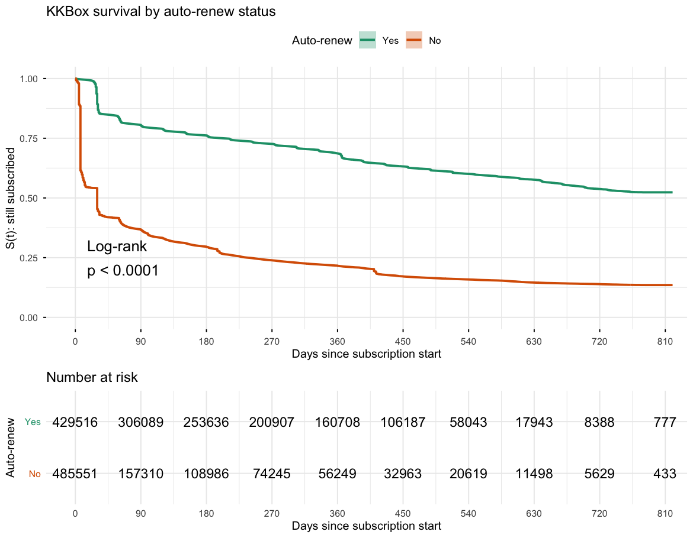
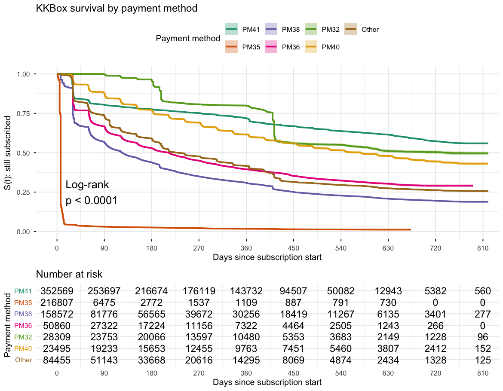
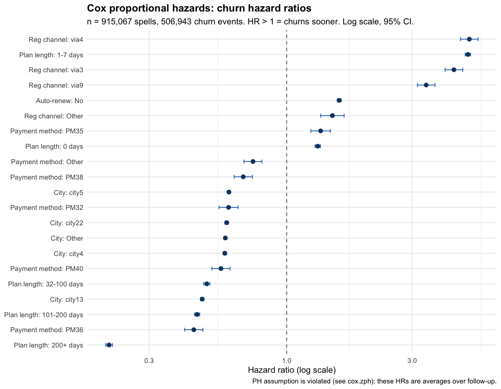
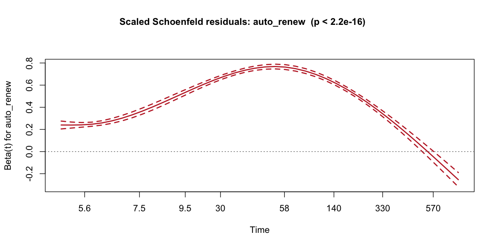
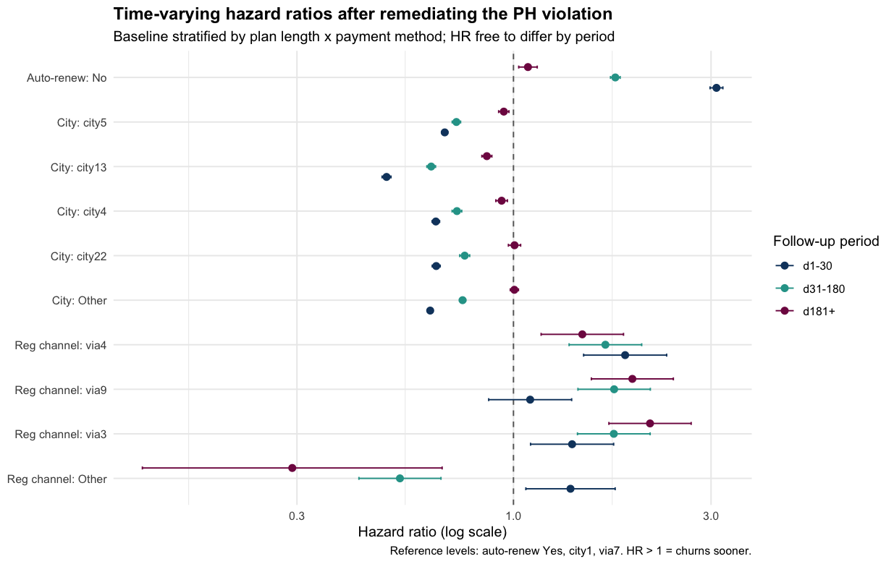
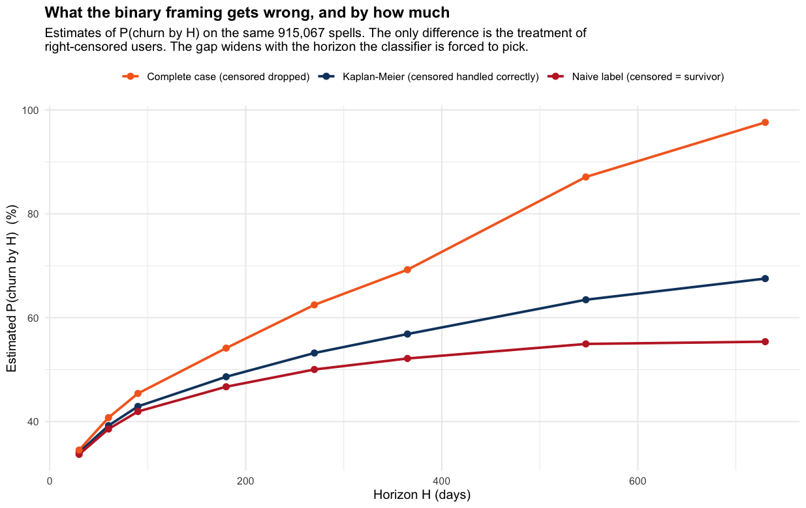

# subscription-survival-analysis

How long does a music-streaming subscriber actually stay subscribed, and what
makes them leave sooner? A time-to-event analysis of **915,067 KKBox
subscriptions**, built in DuckDB and modelled in R with `survival` /
`survminer`.

## The data

[KKBox](https://www.kkbox.com/) is a subscription music-streaming service
operating across Taiwan, Hong Kong, Japan, Singapore and Malaysia. For the
[WSDM Churn Prediction Challenge](https://www.kaggle.com/c/kkbox-churn-prediction-challenge)
it released a transaction log running **2015-01-01 to 2017-03-31**: 22.9M
subscription transactions over 2.4M users, plus a static member profile table
(city, registration channel, registration date).

Subscriptions are prepaid: each transaction buys membership up to a
`membership_expire_date`, for a plan of 7, 30, 410 or other fixed lengths,
with auto-renew either on or off. Nothing here is a monthly rolling contract.

The raw data is not redistributed in this repo — see [Reproducing](#6-reproducing).

## Key findings

| Finding | Number |
|---|---|
| Median subscription lifetime | **196 days** (95% CI 195-198) |
| Auto-renew **off**, first 30 days | **3.09x** the churn hazard (95% CI 2.98-3.20) |
| Auto-renew **off**, after day 180 | 1.08x — the effect is almost entirely a first-month story |
| Longest-lived plan (200+ days) | **0.21x** the hazard of a monthly plan |
| Shortest-lived product (payment method PM35, a 7-day trial) | median lifetime **7 days**, 97.8% churn |
| Proportional-hazards assumption | **Violated for every covariate** — remediated, not ignored |
| Right-censoring | **44.60%** of spells still active at the cutoff |

The single most actionable result: **auto-renew is a first-month effect, not a
durable one.** A subscriber who reaches six months churns at roughly the same
rate whether auto-renew is on or off. Retention effort aimed at auto-renew
belongs in the first 30 days.

## What "churn" means here, and what a "spell" is

These two definitions drive every number above, so they come before the
methods rather than after.

**Churn** follows the competition's own rule: *no renewal within 30 days of
the membership expiry date.* A subscriber whose plan lapses but who renews on
day 12 has not churned; one who renews on day 40 has.

A **spell** is a maximal run of transactions in which every renewal lands
inside that 30-day grace window. A longer gap ends the spell, and that gap is
the churn event. Each user contributes their **first** spell only, so t = 0 is
true subscription inception rather than an arbitrary mid-life snapshot.

Each spell ends in exactly one of three ways:

| Situation | Outcome |
|---|---|
| A later spell exists (they lapsed, then came back) | **event** — churned at the first spell's expiry |
| No later spell, and expiry + 30 days is still before the cutoff | **event** — the full grace window elapsed with no renewal |
| Otherwise | **right-censored** at whichever comes first, the expiry or the 2017-03-31 cutoff |

That third row is the case a binary classifier cannot represent, and it is
44.60% of the data. The rule cannot produce a spell ending after the cutoff,
which is one of the sanity checks in
[`results/01_censoring_report.txt`](results/01_censoring_report.txt).

## Why time-to-event and not classification

The obvious framing is "predict churn (yes/no) in month N". That throws away
most of the information in the data:

- **Right-censoring.** At the cutoff, 408,124 subscribers were still active.
  Their true lifetime is unknown — we only know it is *at least* as long as
  observed. A classifier must either drop them or mislabel them as
  "not churned". Both bias the result; a survival model uses them correctly
  as "survived at least this long".
- **Time is the thing we care about.** "Will they churn?" is less useful than
  "when?". Survival analysis estimates the whole curve S(t), so a median
  lifetime and a 6-month retention rate fall straight out of it.
- **The hazard is not constant.** Confirmed here, emphatically — see
  [the PH section](#4-the-proportional-hazards-assumption-violated).
- **Covariate effects are interpretable** as hazard ratios rather than
  feature importances.

Section 5 quantifies what this actually buys on *this* dataset. The honest
answer is "less than a 44.6% censoring rate suggests at a short horizon, and
steadily more as the horizon lengthens" — see
[Baseline comparison](#5-baseline-comparison-vs-logistic-regression).

---

## 1. Data funnel

Raw Kaggle CSVs -> DuckDB -> one spell per user. Built by
`sql/10_build_spells.sql` via `scripts/build_spells.py`.

| Stage | Rows |
|---|---:|
| `transactions` + `transactions_v2` (raw) | 22,978,755 |
| after de-duplicating the v1/v2 overlap | 22,975,416 |
| after dropping unparseable / out-of-range dates | 22,955,981 |
| distinct users with >=1 clean transaction | 2,425,705 |
| ... with a `members` row (covariates available) | 1,988,086 |
| **modelling cohort** | **915,067** |

Exclusions from the 1,988,086:

| Reason | Users |
|---|---:|
| registered before 2015-01-01 (left-truncated) | 1,070,383 |
| negative duration | 6,609 |
| zero duration | 7,618 |
| registered after their own first transaction | 70 |

The left-truncation exclusion is the big one and is deliberate. The transaction
log starts 2015-01-01, so for anyone already subscribed on that date the true
subscription start is unobservable and the duration would be wrong. Restricting
to accounts *registered* on or after 2015-01-01 guarantees the first observed
transaction really is the first one. See [Limitations](#7-limitations).

### Censoring

| | |
|---|---|
| Observation cutoff | **2017-03-31** (last `transaction_date` in the data) |
| Churn definition | no renewal within **30 days** of membership expiry (the KKBox rule) |
| Total spells | 915,067 |
| Events (churned) | 506,943 (55.40%) |
| Censored (still active) | 408,124 (**44.60% censoring rate**) |
| Median duration | 92 days (churned: 30, censored: 310) |
| Duration range | 1 - 820 days |

Censoring is almost entirely **administrative**: 388,101 of the 408,124 censored
spells are users still paid up past the cutoff; the other 20,023 had a
membership expire too close to the cutoff for the 30-day grace window to finish,
so their outcome is genuinely unknown and they are censored at expiry rather
than guessed at.

All sanity checks pass -- no negative durations, no zero durations, nothing
ending after the cutoff, no churn recorded after the cutoff. Full output:
[`results/01_censoring_report.txt`](results/01_censoring_report.txt).

---

## 2. Kaplan-Meier

**Overall median survival: 196 days (95% CI 195-198).**

| Horizon | S(t) | Churned by then |
|---:|---:|---:|
| 30 days | 0.659 | 34.1% |
| 90 days | 0.571 | 42.9% |
| 180 days | 0.514 | 48.6% |
| 365 days | 0.432 | 56.9% |
| 547 days | 0.365 | 63.5% |



### By auto-renew status

| Group | n | Events | Median survival |
|---|---:|---:|---|
| Auto-renew on | 429,516 | 135,713 | **not reached** (S stays above 0.5 for the whole window) |
| Auto-renew off | 485,551 | 371,230 | **30 days** (95% CI 30-30) |

Log-rank: chi-sq = 247,612 on 1 df, **p < 2.2e-16**.



### By payment method

| Method | n | Events | Median survival (95% CI) |
|---|---:|---:|---|
| PM41 | 352,569 | 103,227 | not reached |
| PM32 | 28,309 | 7,105 | 739 (640 - not reached) |
| PM40 | 23,495 | 9,923 | 577 (549-588) |
| Other | 84,455 | 42,251 | 229 (220-241) |
| PM36 | 50,860 | 25,285 | 212 (203-215) |
| PM38 | 158,572 | 107,016 | 124 (123-125) |
| PM35 | 216,807 | 212,136 | **7 (7-7)** |

Log-rank: chi-sq = 981,617 on 6 df, **p < 2.2e-16**.

PM35 is a 7-day trial-style product: 216,807 spells, 97.8% of which churn, with
a median lifetime of one week. It dominates the short end of the overall curve.



---

## 3. Cox proportional hazards

n = 915,067, 506,943 events. Concordance (C-index) **0.8199** (se 0.0003).
Reference levels: auto-renew on, PM41, 8-31 day plan, city1, channel via7.

Strongest effects (HR > 1 = churns sooner):

| Covariate | HR | 95% CI |
|---|---:|---|
| Registration channel via4 | **4.95** | 4.58 - 5.34 |
| Plan length 1-7 days | **4.88** | 4.77 - 5.00 |
| Registration channel via3 | **4.32** | 4.00 - 4.67 |
| Registration channel via9 | 3.39 | 3.14 - 3.66 |
| Auto-renew **off** | 1.58 | 1.56 - 1.61 |
| Plan length 101-200 days | 0.46 | 0.45 - 0.47 |
| Payment method PM36 | 0.44 | 0.41 - 0.48 |
| Plan length 200+ days | **0.21** | 0.21 - 0.22 |

Full table: [`results/cox_hazard_ratios.csv`](results/cox_hazard_ratios.csv).



---

## 4. The proportional-hazards assumption: **violated**

`cox.zph()` rejects proportionality for **every covariate** and globally.

| Term | chi-sq | df | p |
|---|---:|---:|---|
| auto_renew | 4,466 | 1 | < 2.2e-16 |
| payment_method | 89,278 | 6 | < 2.2e-16 |
| plan_length | 96,766 | 5 | < 2.2e-16 |
| city_grp | 8,461 | 5 | < 2.2e-16 |
| reg_channel | 12,159 | 4 | < 2.2e-16 |
| **GLOBAL** | **117,886** | **21** | **< 2.2e-16** |

At n = 915,067 the test is enormously powered, so a tiny p-value on its own
proves little -- any trivial deviation would reach significance. The violation
was therefore judged on **effect size**, and it is real: the scaled Schoenfeld
residuals for auto-renew show beta(t) moving from about 0.2 to 0.7 and then
below zero across follow-up, which is not a flat line by any reading.



One plot per term, all in `results/`:
[`payment_method`](results/schoenfeld_payment_method.png),
[`plan_length`](results/schoenfeld_plan_length.png),
[`city_grp`](results/schoenfeld_city_grp.png),
[`reg_channel`](results/schoenfeld_reg_channel.png).
The 506,943 individual residual points per panel are suppressed -- at that
density they render as a solid block -- leaving the smoothed beta(t) and its
confidence band, which is what the test is about.

### Remediation

Not ignored. The remediated model does both of the standard fixes:

- **Stratification** on `plan_length` and `payment_method` -- the two largest
  violations, and design/nuisance variables rather than the effects of
  interest. Each gets its own baseline hazard; no proportionality imposed.
- **Time-varying coefficients** for the rest: follow-up is split at 30 and 180
  days with `survSplit` (915,067 spells -> 1,858,506 person-period rows) and
  each covariate is interacted with the resulting period, using Therneau's
  `x:strata(tgroup)` idiom.

Hazard ratio for **auto-renew off**, same data, three specifications:

| Specification | HR |
|---|---:|
| Unstratified Cox, proportional | 1.58 |
| Stratified Cox, proportional | 1.92 |
| Stratified, **days 1-30** | **3.09** (2.98-3.20) |
| Stratified, **days 31-180** | **1.76** (1.72-1.81) |
| Stratified, **days 181+** | **1.08** (1.03-1.14) |

The effect decays by a factor of 2.9 across follow-up. A single constant hazard
ratio is not an adequate summary of it, and the 1.58 in the table above should
not be quoted on its own. Auto-renew is overwhelmingly a *first-month* effect.

Ratio of largest to smallest period-specific HR, as a materiality check:

| Covariate | d1-30 | d31-180 | d181+ | max/min |
|---|---:|---:|---:|---:|
| Auto-renew off | 3.09 | 1.76 | 1.08 | 2.85 |
| City13 | 0.49 | 0.63 | 0.86 | 1.75 |
| Channel via9 | 1.10 | 1.75 | 1.94 | 1.77 |
| Channel via4 | 1.86 | 1.67 | 1.47 | 1.27 |



Concordance of the remediated model is 0.5425, which is **not** a regression:
concordance in a stratified model is computed only within strata, so the
plan-length and payment-method signal is removed from the score by
construction rather than lost.

---

## 5. Baseline comparison vs logistic regression

Same covariates, same data. A classifier needs a fixed horizon H, which the
survival framing never has to invent. Estimating P(churn by H) three ways:

| H (days) | Kaplan-Meier | Naive label | Complete case | Naive bias | CC bias | CC rows dropped |
|---:|---:|---:|---:|---:|---:|---:|
| 30 | 34.09% | 33.68% | 34.52% | -0.41 pp | +0.42 pp | 22,102 |
| 90 | 42.92% | 41.93% | 45.41% | -0.98 pp | +2.49 pp | 70,112 |
| 180 | 48.62% | 46.70% | 54.14% | -1.92 pp | +5.52 pp | 125,724 |
| 365 | 56.85% | 52.15% | 69.24% | -4.71 pp | +12.38 pp | 225,861 |
| 730 | 67.53% | 55.38% | 97.61% | **-12.15 pp** | **+30.08 pp** | 395,902 |

"Naive" scores censored-before-H users as survivors; "complete case" drops them.



Discrimination, reported without declaring a winner -- AUC scores a fixed-horizon
label and the C-index scores the ranking of event *times*, so they are not the
same statistic:

| Model | n used | Score |
|---|---:|---|
| Cox PH | 915,067 (0 dropped) | C-index 0.8199 |
| Logistic, naive label | 915,067 (0 dropped) | AUC 0.8573 |
| Logistic, complete case | 789,343 (125,724 dropped) | AUC 0.8656 |

**Reported honestly, including where the difference is small:**

- At a 30-day horizon the naive label is off by only **0.41 pp**. Censoring here
  is administrative and therefore *late* -- only users who signed up near the
  2017-03-31 cutoff can be censored early, and there are few. The binary framing
  is defensible at short horizons on this dataset, and the 44.6% censoring rate
  overstates how much damage it does.
- The bias grows monotonically with the horizon, to **12.15 pp at 730 days**.
- Complete-case analysis is worse at every horizon tested, in both directions:
  more bias *and* it discards up to 395,902 spells.
- The two logistic variants agree with Cox on the **direction** of 19 of 21
  covariate effects. The two disagreements are both catch-all "Other" buckets.
  The binary framing distorts magnitudes and the headline rate, not usually
  the sign.
- The plain "did they ever churn" label is not a fixed-horizon quantity at all:
  it ranges from 5.9% to 86.3% across signup quarters, largely because the
  2017-Q1 cohort has at most 89 days of follow-up. A model trained on it partly
  learns the calendar.
- Only the survival model produces a median lifetime or a full S(t). No
  fixed-horizon classifier can.

Full output: [`results/04_baseline_comparison.txt`](results/04_baseline_comparison.txt).

---

## 6. Reproducing

Verified end to end on macOS (Darwin 25.5) with Python 3.11.9 and R 4.5.1.

### Versions

| | Version | Notes |
|---|---|---|
| Python | 3.11.9 | exact pins in `requirements.txt` |
| duckdb | 1.5.5 | |
| pandas | 3.0.5 | |
| pyarrow | 25.0.1 | |
| kaggle | 2.2.4 | download client |
| py7zr | 1.1.3 | the competition ships `.7z` archives |
| R | 4.5.1 | |
| survival | 3.8.3 | `coxph`, `survfit`, `cox.zph`, `survSplit` |
| survminer | 0.5.2 | `ggsurvplot` |
| ggplot2 | 4.0.0 | note: `geom_errorbarh` is deprecated in 4.0, hence `width=` |
| broom | 1.0.12 | tidying model output |

### 1. Kaggle API token (do this first)

1. Kaggle -> **Account -> Settings -> API -> Create New Token** (`kaggle.json`).
2. Put it in place:
   ```bash
   mkdir -p ~/.kaggle && mv ~/Downloads/kaggle.json ~/.kaggle/
   chmod 600 ~/.kaggle/kaggle.json
   ```
3. **Accept the competition rules**, or the download 403s:
   <https://www.kaggle.com/c/kkbox-churn-prediction-challenge/rules>

`kaggle.json` is gitignored and must never be committed.

### 2. Python: download, load, build spells

```bash
python3 -m venv .venv && source .venv/bin/activate
pip install -r requirements.txt

python scripts/download_data.py    # ~1.3 GB download, ~7 GB extracted
python scripts/load_data.py        # -> data/processed/kkbox.duckdb (~2.1 GB)
python scripts/build_spells.py     # -> spells table + data/processed/spells.csv
python scripts/check_censoring.py  # sanity report; exits non-zero if it fails
```

Run these in order — each depends on the previous one. `check_censoring.py` is
a gate, not decoration: it exits non-zero if any implausible row (negative or
zero duration, a spell ending after the cutoff) survives into the modelling
cohort, so a broken data layer stops the pipeline instead of quietly
producing wrong survival curves.

`download_data.py` also accepts `--with-user-logs`, which fetches the daily
listening logs (~30 GB uncompressed). **This analysis does not use them** —
skip the flag unless you are extending the work.

### 3. R: the survival analysis

```bash
Rscript -e 'install.packages(c("survival","survminer","ggplot2","broom"), repos="https://cloud.r-project.org")'
Rscript R/run_all.R                # -> results/
```

`run_all.R` runs `01_kaplan_meier.R`, `02_cox_ph.R` and `03_logistic_baseline.R`
in order, each in its own process, and stops on the first failure. Any of the
three can also be run on its own; each sources `R/00_setup.R` for paths and
factor preparation.

Every script — Python and R — resolves its paths from its own file location,
so all of them work from any working directory.

Neither the raw CSVs nor `kkbox.duckdb` are committed; `results/` is, so the
figures and numbers below can be checked without re-running anything.

---

## 7. Limitations

Things that would change the numbers above, roughly in order of how much:

1. **The cohort is accounts registered on or after 2015-01-01 only — the
   single biggest caveat.** The transaction log begins 2015-01-01, so anyone
   already subscribed on that date has an unobservable start and would be
   left-truncated: their measured duration would start mid-life and be wrong.
   Excluding them is necessary for a correct time origin, but it removes
   **1,070,383 of 1,988,086 users (53.8%)**. These results therefore describe
   *subscribers acquired during 2015-2017*, not KKBox's whole base. Long-
   tenured pre-2015 subscribers are very likely more loyal, so the 196-day
   median almost certainly understates lifetime for the full population. A
   proper fix would use left-truncated `Surv(start, stop, event)` entry times
   against a known registration date, which this dataset does not supply for
   pre-2015 subscription starts.
2. **First spell only.** Users who churn and later resubscribe contribute only
   their first spell. Win-back behaviour and repeat lifetimes are out of scope,
   and a user with three short spells is counted once.
3. **Proportional hazards does not hold.** Single-number HRs in section 3 are
   averages over follow-up and should not be quoted alone; use the
   period-specific figures in section 4.
4. **Covariates are frozen at spell start.** Plan length, payment method and
   auto-renew are taken from the first transaction of the spell and held fixed.
   In reality users switch plans and toggle auto-renew mid-subscription. The
   model has time-varying *coefficients* but not time-varying *covariates*.
5. **Payment method and plan length are badly confounded.** PM35 is
   overwhelmingly the 7-day product (97.8% churn, 7-day median). Their separate
   hazard ratios should not be read causally, and `registered_via` effects are
   likely picking up acquisition-campaign mix as well.
6. **City and channel are opaque integer codes.** `city1` covers 67.5% of the
   cohort and is plausibly an unknown/unspecified bucket rather than a real
   city, so "City: ..." effects are contrasts against a mixed reference.
7. **The 30-day grace period is a convention.** It is the standard KKBox
   definition, but no sensitivity analysis was run at 15 or 45 days.
8. **All figures are in-sample.** No train/test split or cross-validation. With
   915k rows and 21 parameters the optimism is small, but the AUC and C-index
   are not held-out estimates.
9. **Independent censoring is assumed.** With a single administrative cutoff
   this is reasonable, but signup-cohort composition varies a lot by quarter
   (see section 6 of the baseline report), so it is an assumption, not a fact.
10. **Some dirty rows were dropped, not repaired.** 19,435 transactions had
    unparseable or out-of-range dates. Expiry dates up to 2018-12-31 were kept
    as plausible long plans; the dataset also contains clearly junk values such
    as 2036-10-15.
11. **`bd` (age) and `gender` are unused.** Both are known to be heavily
    mis-entered in this dataset (ages in the hundreds, large missing blocks).

---

## Repository structure

```
subscription-survival-analysis/
├── data/
│   ├── raw/                     raw Kaggle CSVs                  (gitignored)
│   └── processed/               kkbox.duckdb, spells.csv         (gitignored)
├── sql/
│   ├── 00_load_raw.sql          load raw CSVs into DuckDB
│   └── 10_build_spells.sql      transactions -> per-user spells
├── scripts/
│   ├── download_data.py         pull + extract the Kaggle dataset
│   ├── load_data.py             run the SQL loader, print row counts
│   ├── build_spells.py          build the spells table, export spells.csv
│   └── check_censoring.py       censoring sanity report (gates the modelling)
├── R/
│   ├── 00_setup.R               paths, data loading, factor preparation
│   ├── 01_kaplan_meier.R        KM curves, medians, log-rank tests
│   ├── 02_cox_ph.R              Cox PH, cox.zph, remediated model
│   ├── 03_logistic_baseline.R   logistic baseline comparison
│   └── run_all.R                run all three in order
├── results/                     committed figures and reports
├── requirements.txt
└── .gitignore
```

## Data source

WSDM - KKBox's Churn Prediction Challenge,
<https://www.kaggle.com/c/kkbox-churn-prediction-challenge>. Data is subject
to the competition rules and is not redistributed in this repo.
